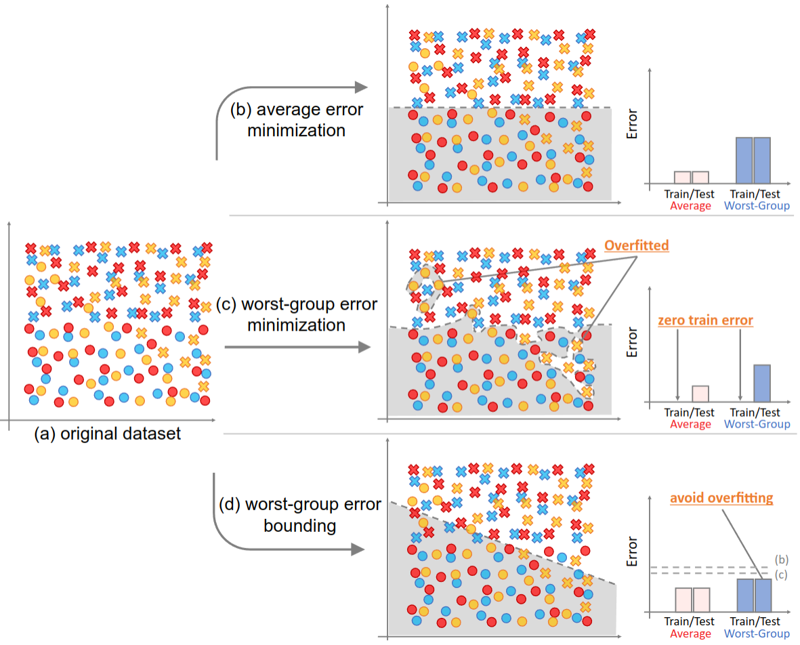

# Worst-group-main

This repository provides the code for my research [Worst-group Error Bounding by Boosting](https://ken.ieice.org/ken/paper/20241130dc5A/) in Pytorch.

We built on the implementation of [group DRO](https://github.com/kohpangwei/group_DRO), to which we add the
implementation of  ```Worst-group Error Bounding by Boosting```. Group DRO was featured on the paper:

> Shiori Sagawa*, Pang Wei Koh*, Tatsunori Hashimoto, and Percy Liang
>
> [Distributionally Robust Neural Networks for Group Shifts: On the Importance of Regularization for Worst-Case Generalization](https://arxiv.org/abs/1911.08731)


[Paper] | [Bibtex] | [Slides](./images/PRMU2024.png)

## Overveiw of Our Method


> In machine learning-based classification, accuracy can vary across different groups. For example, in the classification of normal and abnormal medical images, the accuracy may differ significantly between Hospital A and Hospital B, where each hospital's data represents a distinct group. It is crucial to avoid situations where the accuracy for a particular group is significantly lower. In other words, it is necessary to mitigate the worst-group error. In practical applications, a decline in predictive performance for specific groups, such as those defined by gender or nationality, can pose serious issues. Therefore, this study aims to suppress the worst-group error to prevent the deterioration of predictive performance for certain groups.

## Requirements 
<!-- All codes are written by Python 3.7, and 'requirements.txt' contains required Python packages. -->
- python >= 3.8
- cuda & cudnn

### prerequisitions
- python 3.8.19
- matplotlib 3.7.5
- seaborn  0.13.2
- scikit-learn  1.3.2
- pandas 2.0.3
- Pillow 10.3.0
- torch  2.0.1
- torchvision 0.18.1py
- pytorch_transformers 1.2.0
- tqdm  4.66.4
- numpy 1.24.3


To install fast-setup of this code:

```setup
# pytorch install 
pip install torch torchvision torchaudio --index-url https://download.pytorch.org/whl/cu121
pip install -r requirements.txt
```


## Dataset

For the worst-group bounding experiments, we use the **Waterbirds** dataset, which consists of 2 classes{waterbirds,landbirds} and 4 groups {waterbirds-on-water, waterbirds-on-land,landbirds-on-land, landbirds-on-water}. We shuffled the original train/validation/test data and split them into 6:2:2 for the equal group distribution. You can use this datasets with 3 steps.

**1. Downloading the original waterbirds dataset**

Before running the experiments, the dataset must be downloaded and placed
in the `data` folder. You can do this by running the following commands:

```bash
wget -P data https://nlp.stanford.edu/data/dro/waterbird_complete95_forest2water2.tar.gz
tar -xf data/waterbird_complete95_forest2water2.tar.gz -C group_imbalance/data
```

**2. Shuffle and split the original dataset**

We provide the way to shuffle and split procedures. You can find them in ```data/cub_dataset.py``` and get the csv file ```data/shuffle_metadata_seedX.csv```  

**3. Select and set the dataset**

After getting the ```data/shuffle_metadata_seedX.csv```, you have to set the them in ```data/cub_dataset.py``` as below:

```bash
self.metadata_df = pd.read_csv(
    os.path.join(self.data_dir, 'shuffle_metadata_seedX.csv'))
```

## Training & Test

We provide several examples:

<!-- ### Artificial dataset
---

- Ours (train)

```bash -->

<!-- ``` -->

### shuffled waterbirds dataset (train & test)
---
- ERM

```bash
python main.py -s confounder -d CUB -t waterbird_complete95 -c forest2water2 --model resnet50 --weight_decay 0.1 --lr 0.0001 --batch_size 512 --n_epochs 300 --save_step 1000 --save_best --save_last --gpu_num 0 --log_dir 'result/water_birds/ERM_lr_0.0001_wd_0.1/'
```

- Naive

```bash
### ERM + weight_decay=0.0
python main.py -s confounder -d CUB -t waterbird_complete95 -c forest2water2 --dont_set_seed 1 --model resnet50 --weight_decay 0.0 --lr 0.0001 --batch_size 512 --n_epochs 300 --save_step 1000 --save_best --save_last --gpu_num 0 --log_dir 'result/water_birds/Naive_lr_0.0001_wd_0/'  
```

- DRO

```bash
python main.py -s confounder -d CUB -t waterbird_complete95 -c forest2water2 --model resnet50 --weight_decay 0.1 --lr 0.0001 --batch_size 512 --n_epochs 300 --save_step 1000 --save_best --save_last --reweight_groups --robust --alpha 0.01 --gamma 0.1 --generalization_adjustment 0 --gpu_num 0 --log_dir 'result/water_birds/sagawaDRO_lr_0.0001_wd_0.1/'
```

- VS loss

```bash
python main.py -s confounder -d CUB -t waterbird_complete95 -c forest2water2 --lr 0.001 --batch_size 512 --weight_decay 0.0001 --model resnet50 --n_epochs 300 --gamma 0.1 --generalization_adjustment 0 --loss vs --vs_alpha 0.3 --dont_set_seed 1 --robust --gpu_num 0 --log_dir 'result/water_birds/VS+DRO_lr_0.0001_wd_0.0001/'
```

- Ours

```bash
### theta = {0.1,...,0.9} 
bash run.sh ### change the batch_size=512 to batch_size=128 according to your PC memory capacity
```